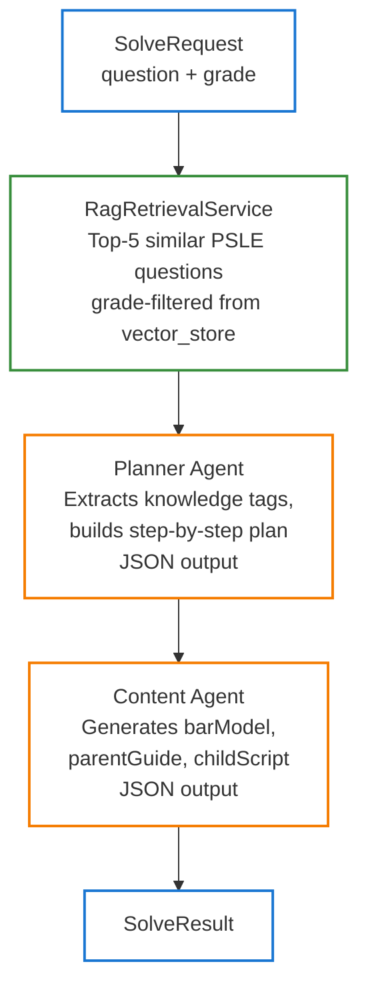

# Architecture

## Tech Stack

| Layer | Technology | Version |
|:------|:-----------|:--------|
| Backend language | Java | 25 (LTS) |
| Backend framework | Spring Boot | 4.0.3 (Spring Framework 7) |
| AI integration | Spring AI | 2.0.0-M2 |
| Build | Gradle | 9.2 |
| Frontend | Kotlin Multiplatform + Compose for Web (Wasm) | Kotlin 2.3+ |
| Database | PostgreSQL + pgvector | 17, 768-dim HNSW index |
| Cache | Redis | 7.x |
| LLM (dev) | Ollama + qwen3.5:2b | local, zero API cost |
| LLM (prod) | DeepSeek-R1 | via OpenAI-compatible API |

Key Java 25 features in use: **Virtual Threads** (high-concurrency agent requests), **Structured Concurrency** (`StructuredTaskScope`, preview), **Scoped Values** (preview).

---

## Agent Pipeline

The solve pipeline makes two sequential LLM calls:



### Planner Agent

- **Input**: raw question + grade + RAG context (top-5 similar questions)
- **Output**: `{"knowledgeTags":[...],"steps":[...],"answer":"...","difficulty":"easy|medium|hard"}`
- Extracts PSLE knowledge tags used to populate `knowledge_progress` table

### Content Agent

- **Input**: Planner output JSON + grade
- **Output**: `{"barModel":{...},"parentGuide":"...","childScript":"..."}`
- Generates three artefacts in one call to reduce latency (originally two separate agents)

### RAG Retrieval

- Embeds the question using `nomic-embed-text` (768-dim)
- Searches `vector_store` table with cosine similarity, filtered by `metadata.grade <= request.grade`
- Returns top-5 results as few-shot context in the Planner prompt

### Redis Cache

`SolveService` wraps the pipeline with `@Cacheable("solveResults")`. Cache key: `question + grade`. TTL: 24 hours. First call ~16s (local Ollama), subsequent calls < 100ms.

---

## Data Flow (Full Request)

```
Browser (Compose Wasm)
  │  POST /api/v1/solve/stream (SSE)
  │  Authorization: Bearer <jwt>
  ▼
JwtAuthenticationFilter
  │  Validates JWT, sets SecurityContext (userId)
  ▼
SolveController
  │  SolveService.solve() — @Cacheable
  ▼
MathSolverOrchestrator
  ├── RagRetrievalService → pgvector (vector_store)
  ├── Planner Agent → OllamaChatModel (ChatClient)
  └── Content Agent → OllamaChatModel (ChatClient)
  │
  ▼
SolveResult
  ├── → SSE events (parent_guide, child_script, bar_model, knowledge_tags)
  ├── → solve_records (if studentId provided)
  └── → knowledge_progress (upsert attempt_count for each knowledgeTag)
```

---

## Data Model

### PostgreSQL Schema

```sql
-- User accounts
CREATE TABLE users (
    id         UUID PRIMARY KEY DEFAULT gen_random_uuid(),
    email      VARCHAR(255) UNIQUE NOT NULL,
    password   VARCHAR(255) NOT NULL,          -- BCrypt hashed
    created_at TIMESTAMPTZ DEFAULT NOW()
);

-- Student profiles (child under a parent account)
CREATE TABLE student_profiles (
    id         UUID PRIMARY KEY DEFAULT gen_random_uuid(),
    parent_id  UUID REFERENCES users(id) ON DELETE CASCADE,
    name       VARCHAR(100) NOT NULL,
    grade      INTEGER NOT NULL CHECK (grade BETWEEN 1 AND 6),
    created_at TIMESTAMPTZ DEFAULT NOW()
);

-- Solve history
CREATE TABLE solve_records (
    id             UUID PRIMARY KEY DEFAULT gen_random_uuid(),
    student_id     UUID REFERENCES student_profiles(id) ON DELETE CASCADE,
    question_text  TEXT NOT NULL,
    parent_guide   TEXT,
    child_script   TEXT,
    bar_model_json JSONB,
    knowledge_tags TEXT[],
    rating         INTEGER CHECK (rating BETWEEN 1 AND 5),  -- parent star rating (1-5)
    created_at     TIMESTAMPTZ DEFAULT NOW()
);

-- Knowledge point mastery
CREATE TABLE knowledge_progress (
    id             UUID PRIMARY KEY DEFAULT gen_random_uuid(),
    student_id     UUID REFERENCES student_profiles(id) ON DELETE CASCADE,
    knowledge_code VARCHAR(50) NOT NULL,       -- e.g. "ratio.basic"
    mastery_score  DECIMAL(5,2) DEFAULT 0,
    attempt_count  INTEGER DEFAULT 0,
    correct_count  INTEGER DEFAULT 0,
    mastery_level  VARCHAR(10) NOT NULL DEFAULT 'UNKNOWN'
                   CHECK (mastery_level IN ('UNKNOWN', 'FAMILIAR', 'MASTERED')),
    updated_at     TIMESTAMPTZ DEFAULT NOW(),
    UNIQUE (student_id, knowledge_code)
);

-- Knowledge graph nodes (P1-P6 Singapore Math syllabus)
CREATE TABLE knowledge_nodes (
    code        VARCHAR(100) PRIMARY KEY,
    name_en     VARCHAR(200) NOT NULL,
    name_zh     VARCHAR(200) NOT NULL,
    parent_code VARCHAR(100) REFERENCES knowledge_nodes(code),
    grade_start INTEGER NOT NULL CHECK (grade_start BETWEEN 1 AND 6),
    sort_order  INTEGER NOT NULL DEFAULT 0
);

-- Assessment question bank
CREATE TABLE assessment_questions (
    id            UUID PRIMARY KEY DEFAULT gen_random_uuid(),
    question_text TEXT NOT NULL,
    grade         INTEGER NOT NULL CHECK (grade BETWEEN 1 AND 6),
    difficulty    VARCHAR(10) NOT NULL CHECK (difficulty IN ('easy', 'medium', 'hard')),
    answer_hint   TEXT
);

-- Many-to-many: questions <-> knowledge nodes
CREATE TABLE assessment_question_tags (
    question_id UUID REFERENCES assessment_questions(id) ON DELETE CASCADE,
    node_code   VARCHAR(100) REFERENCES knowledge_nodes(code),
    PRIMARY KEY (question_id, node_code)
);

-- RAG vector store (managed by Spring AI PgVectorStore)
CREATE TABLE vector_store (
    id        UUID PRIMARY KEY DEFAULT gen_random_uuid(),
    content   TEXT,
    metadata  JSONB,                            -- {grade, topic, difficulty, source}
    embedding vector(768)
);
CREATE INDEX ON vector_store USING hnsw (embedding vector_cosine_ops);
```

Schema is managed by Flyway (`backend/src/main/resources/db/migration/`, V1–V3). The `vector_store` table is auto-created by Spring AI (`initialize-schema: true`). Seed data includes 63 knowledge nodes and 68 assessment questions.

### Redis

`solveResults` cache: key = `MD5(question + grade)`, value = serialised `SolveResult` JSON, TTL = 24h.

---

## Notable Design Decisions

### OllamaConfig Interceptor (Spring AI 2.0.0-M2 Workaround)

Spring AI 2.0.0-M2 has a bug where `OllamaChatOptions.disableThinking()` leaks the `think` field into Ollama's `options` map, causing HTTP 400. `OllamaConfig` registers a `RestClientCustomizer` that strips the field at the HTTP layer, allowing `ChatClient` to be used normally.

Upstream fix: [spring-ai#5435](https://github.com/spring-projects/spring-ai/pull/5435). Once merged in a release, delete `OllamaConfig.ollamaThinkFieldFixCustomizer()`.

See [reference/troubleshooting.md](reference/troubleshooting.md) for full analysis.

### Why thinking mode is disabled

qwen3.5 with Ollama 0.12+ defaults to thinking mode: ~52s per call. Disabling it brings latency to ~16s. PSLE primary school math does not require deep chain-of-thought reasoning.

### Why CPA Designer and Persona are one agent call

Originally two parallel agents; merged into a single Content Agent call after profiling showed the parallel overhead wasn't worthwhile at this scale and the combined prompt fits within context limits.

