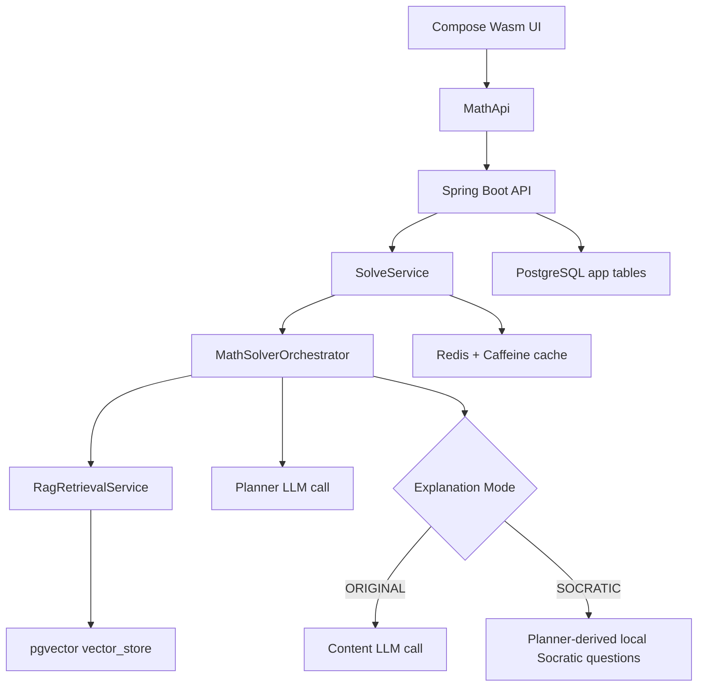

# Architecture

## Tech Stack

| Layer | Technology | Version |
|:------|:-----------|:--------|
| Backend language | Java | 25 |
| Backend framework | Spring Boot | 4.0.3 |
| AI integration | Spring AI | 2.0.0-M2 |
| Build | Gradle | 9.2 |
| Frontend | Kotlin Multiplatform + Compose Wasm | Kotlin 2.2.20, Compose 1.10.2 |
| Database | PostgreSQL + pgvector | PostgreSQL 17 |
| Cache | Redis + Caffeine | Redis 7 |
| OCR | `tesseract.js` in browser | v5 CDN build |
| Dev LLM | Ollama | `qwen3.5` |
| Prod LLM | OpenAI-compatible provider | currently documented for DeepSeek |

The app is optimized for local-first development: PostgreSQL, Redis, Ollama, backend, and Wasm frontend all run on a single machine.

---

## Runtime Architecture



### Key idea

The application has one canonical solve pipeline, and the surrounding features enhance it rather than fork it:

- OCR converts an image into question text before the solve request is sent.
- `ExplanationMode` controls whether the second stage is a direct explanation or a planner-derived Socratic walkthrough.
- ratings, knowledge tracking, achievements, and recommendations are all downstream of solve records and knowledge progress.

---

## Solve Pipeline

### 1. Deterministic fast path

`MathSolverOrchestrator` first checks whether a question is simple arithmetic such as `3 + 4`, `12 ÷ 3`, or `What is 8 x 7?`.

If it matches the arithmetic regex, the result is computed locally and returned immediately. This is the main first-response latency optimization for trivial questions.

### 2. RAG retrieval

If the question is not handled locally, `RagRetrievalService`:

- embeds the question with `nomic-embed-text`
- filters by `metadata.grade <= request.grade`
- returns up to **3** similar questions
- formats them as a compact bullet list for the planner prompt

### 3. Planner call

The planner LLM call returns JSON describing:

- `knowledgeTags`
- `steps`
- `answer`
- `difficulty`

These tags feed the knowledge tracking and recommendation systems.

### 4. Explanation mode routing

| Mode | Implementation |
|:-----|:---------------|
| `ORIGINAL` | Planner JSON is sent to a content prompt that generates parent guide, child script, and bar model. |
| `SOCRATIC` | No second LLM call is made. The app converts planner JSON into 2-4 guiding questions locally, which avoids another slow round trip. |

### 5. Persistence and enrichment

If `studentId` is present:

- a solve record is stored in `solve_records`
- knowledge tags increment `knowledge_progress.attempt_count`
- later parent ratings can promote mastery levels

---

## Phase 10 Features

Phase 10 is implemented without introducing new persistence tables.

### Achievement wall

`StudentPhase10Service` computes badge progress dynamically from:

- solve record count
- distinct practice days
- current streak length
- rated explanations
- mastered knowledge nodes
- fraction-related mastery

This keeps the feature lightweight while still surfacing meaningful engagement signals.

### Adaptive learning path

The same service builds a recommendation by combining:

- the student's knowledge progress
- the knowledge graph hierarchy
- question-bank tags

The algorithm chooses the weakest non-mastered focus node, checks only the **direct prerequisite**, and then retrieves up to three tagged challenge questions.

### Frontend page split (UI redesign)

To avoid overloading one page, growth-heavy widgets were split out:

- `Knowledge` page: star map + mastery tree editing
- `Growth` page: badge wall, snapshot counters, adaptive challenge card
- `Mistakes` page: low-rated ledger + export preview (Phase 9 skeleton)

This keeps navigation goal-oriented and reduces cognitive load per screen.

### Phase 9 skeleton

`RecordController` now exposes:

- `GET /api/v1/records/mistakes` for rating-based mistake retrieval
- `GET /api/v1/records/{recordId}/export` for printable/PDF-ready payloads

---

## Caching Strategy

`SolveService` uses a multi-layer cache:

- L1 exact cache via Redis `@Cacheable`
- L2 semantic cache via pgvector similarity + Caffeine
- L3 full solve pipeline

The exact-match cache key is:

`question.trim().lowercase() + ":" + grade + ":" + mode`

This avoids cross-contaminating direct explanations and Socratic explanations.

---

## Data Flow

```text
Browser (Compose Wasm)
  -> optional OCR in browser
  -> POST /api/v1/solve
  -> Spring Security JWT filter
  -> SolveController
  -> SolveService
  -> MathSolverOrchestrator
     -> fast path OR RAG + planner (+ content/or local Socratic)
  -> SolveResult
  -> optional solve_records persistence
  -> optional knowledge_progress tracking
  -> later rating / achievements / recommendation refresh
```

---

## Data Model

### PostgreSQL Schema

```sql
-- User accounts
CREATE TABLE users (
    id         UUID PRIMARY KEY DEFAULT gen_random_uuid(),
    email      VARCHAR(255) UNIQUE NOT NULL,
    password   VARCHAR(255) NOT NULL,          -- BCrypt hashed
    created_at TIMESTAMPTZ DEFAULT NOW()
);

-- Student profiles (child under a parent account)
CREATE TABLE student_profiles (
    id         UUID PRIMARY KEY DEFAULT gen_random_uuid(),
    parent_id  UUID REFERENCES users(id) ON DELETE CASCADE,
    name       VARCHAR(100) NOT NULL,
    grade      INTEGER NOT NULL CHECK (grade BETWEEN 1 AND 6),
    created_at TIMESTAMPTZ DEFAULT NOW()
);

-- Solve history
CREATE TABLE solve_records (
    id             UUID PRIMARY KEY DEFAULT gen_random_uuid(),
    student_id     UUID REFERENCES student_profiles(id) ON DELETE CASCADE,
    question_text  TEXT NOT NULL,
    parent_guide   TEXT,
    child_script   TEXT,
    bar_model_json JSONB,
    knowledge_tags TEXT[],
    rating         INTEGER CHECK (rating BETWEEN 1 AND 5),  -- parent star rating (1-5)
    created_at     TIMESTAMPTZ DEFAULT NOW()
);

-- Knowledge point mastery
CREATE TABLE knowledge_progress (
    id             UUID PRIMARY KEY DEFAULT gen_random_uuid(),
    student_id     UUID REFERENCES student_profiles(id) ON DELETE CASCADE,
    knowledge_code VARCHAR(50) NOT NULL,       -- e.g. "ratio.basic"
    mastery_score  DECIMAL(5,2) DEFAULT 0,
    attempt_count  INTEGER DEFAULT 0,
    correct_count  INTEGER DEFAULT 0,
    mastery_level  VARCHAR(10) NOT NULL DEFAULT 'UNKNOWN'
                   CHECK (mastery_level IN ('UNKNOWN', 'FAMILIAR', 'MASTERED')),
    updated_at     TIMESTAMPTZ DEFAULT NOW(),
    UNIQUE (student_id, knowledge_code)
);

-- Knowledge graph nodes (P1-P6 Singapore Math syllabus)
CREATE TABLE knowledge_nodes (
    code        VARCHAR(100) PRIMARY KEY,
    name_en     VARCHAR(200) NOT NULL,
    name_zh     VARCHAR(200) NOT NULL,
    parent_code VARCHAR(100) REFERENCES knowledge_nodes(code),
    grade_start INTEGER NOT NULL CHECK (grade_start BETWEEN 1 AND 6),
    sort_order  INTEGER NOT NULL DEFAULT 0
);

-- Assessment question bank
CREATE TABLE assessment_questions (
    id            UUID PRIMARY KEY DEFAULT gen_random_uuid(),
    question_text TEXT NOT NULL,
    grade         INTEGER NOT NULL CHECK (grade BETWEEN 1 AND 6),
    difficulty    VARCHAR(10) NOT NULL CHECK (difficulty IN ('easy', 'medium', 'hard')),
    answer_hint   TEXT
);

-- Many-to-many: questions <-> knowledge nodes
CREATE TABLE assessment_question_tags (
    question_id UUID REFERENCES assessment_questions(id) ON DELETE CASCADE,
    node_code   VARCHAR(100) REFERENCES knowledge_nodes(code),
    PRIMARY KEY (question_id, node_code)
);

-- RAG vector store (managed by Spring AI PgVectorStore)
CREATE TABLE vector_store (
    id        UUID PRIMARY KEY DEFAULT gen_random_uuid(),
    content   TEXT,
    metadata  JSONB,                            -- {grade, topic, difficulty, source}
    embedding vector(768)
);
CREATE INDEX ON vector_store USING hnsw (embedding vector_cosine_ops);
```

Schema is managed by Flyway (`backend/src/main/resources/db/migration/`, V1–V3). Seed data currently includes 63 knowledge nodes and 68 tagged assessment questions.

---

## Notable Design Decisions

### OllamaConfig Interceptor (Spring AI 2.0.0-M2 Workaround)

Spring AI 2.0.0-M2 has a bug where `OllamaChatOptions.disableThinking()` leaks the `think` field into Ollama's `options` map, causing HTTP 400. `OllamaConfig` registers a `RestClientCustomizer` that strips the field at the HTTP layer, allowing `ChatClient` to be used normally.

Upstream fix: [spring-ai#5435](https://github.com/spring-projects/spring-ai/pull/5435). Once merged in a release, delete `OllamaConfig.ollamaThinkFieldFixCustomizer()`.

See [reference/troubleshooting.md](reference/troubleshooting.md) for full analysis.

### Why thinking mode is disabled

qwen3.5 with Ollama 0.12+ defaults to thinking mode: ~52s per call. Disabling it brings latency to ~16s. PSLE primary school math does not require deep chain-of-thought reasoning.

### Why Socratic mode is planner-derived

The earliest implementation used a second LLM hop for Socratic explanations. That made the slowest path even slower.

The current design reuses planner output and generates the Socratic questioning sequence locally. This keeps the interaction style while cutting a full LLM round trip.

### Why achievements are computed dynamically

Phase 10 badges are derived from existing records and progress rows instead of a new `achievements` table. That keeps the model simpler and avoids migration overhead while the badge taxonomy is still evolving.

