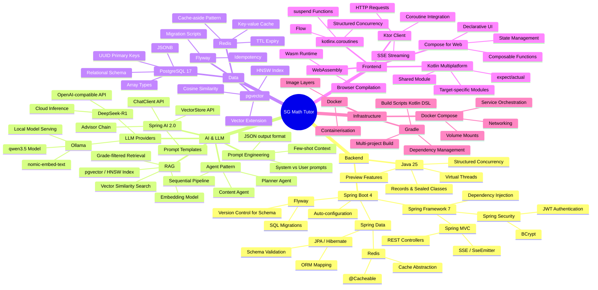

# Learning Guide

This project is a runnable AI tutoring app under active iteration. Use it to learn modern backend, frontend, and AI engineering through real code and evolving architecture decisions.

---

## Technology Inventory

### Backend Core

| Technology | Version | Role in Project |
|:-----------|:--------|:----------------|
| Java | 25 (LTS) | Primary backend language |
| Spring Boot | 4.0.3 | Application framework, auto-configuration |
| Spring Framework | 7.x | Core DI, MVC, WebFlux primitives |
| Spring MVC | (bundled) | REST controllers, SSE (`SseEmitter`) |
| Spring Security | (bundled) | JWT auth scaffolding, BCrypt password hashing |
| Spring Data JPA | (bundled) | ORM layer, repository pattern |
| Hibernate | (bundled) | JPA implementation, schema validation |
| Flyway | (bundled) | Database schema migrations |
| Lombok | 1.18.42 | Boilerplate reduction (`@Data`, `@Builder`, etc.) |
| Gradle | 9.2 | Build tool, dependency management |

### AI & LLM Integration

| Technology | Version | Role in Project |
|:-----------|:--------|:----------------|
| Spring AI | 2.0.0-M2 | Unified LLM abstraction (`ChatClient`, `VectorStore`) |
| Ollama | latest | Local LLM runtime (dev environment) |
| qwen3.5:2b | — | Chat/reasoning model for agent pipeline |
| nomic-embed-text | — | Embedding model, 768-dim vectors |
| DeepSeek-R1 | — | Cloud LLM for production (OpenAI-compatible API) |

### Data & Persistence

| Technology | Version | Role in Project |
|:-----------|:--------|:----------------|
| PostgreSQL | 17 | Primary relational database |
| pgvector | (bundled) | Vector similarity search extension |
| Spring AI PgVectorStore | (bundled) | RAG vector store with HNSW index |
| Redis | 7.x | Response caching (`@Cacheable`, 24h TTL) |
| Spring Data Redis | (bundled) | Redis integration, cache abstraction |
| Jackson | (bundled) | JSON serialisation/deserialisation |

### Frontend

| Technology | Version | Role in Project |
|:-----------|:--------|:----------------|
| Kotlin | 2.1+ | Frontend language (same language as shared module) |
| Kotlin Multiplatform (KMP) | 2.1+ | Shared code between targets |
| Compose for Web (Wasm) | (bundled) | UI framework compiled to WebAssembly |
| Ktor Client | 3.0.2 | HTTP client (fetch-based on Wasm/JS) |
| kotlinx.serialization | 1.7.3 | JSON parsing on frontend |
| kotlinx.coroutines | 1.9.0 | Async/reactive programming |
| WebAssembly (Wasm) | — | Browser execution target for Kotlin |

### Infrastructure

| Technology | Version | Role in Project |
|:-----------|:--------|:----------------|
| Docker | recent | Container runtime |
| Docker Compose | recent | Local infra orchestration (PostgreSQL + Redis) |
| Helm | 3.x | Kubernetes package manager (Phase 9) |
| ArgoCD | — | GitOps continuous deployment (Phase 9) |
| GitHub Actions | — | CI pipeline (Phase 8) |

---

## Knowledge Graph



---

## Prerequisite Dependency Map

Read bottom-up — each layer depends on the layers below it.

```
┌─────────────────────────────────────────────────────────────────────┐
│  Application Layer (What this project builds)                       │
│  Agent Pipeline · RAG Retrieval · SSE Streaming · Compose Wasm UI  │
└──────────────────────────┬──────────────────────────────────────────┘
                           │ requires
┌──────────────────────────▼──────────────────────────────────────────┐
│  Framework Layer                                                     │
│  Spring Boot 4 · Spring AI 2.0 · Kotlin Multiplatform · Compose    │
└──────────────────────────┬──────────────────────────────────────────┘
                           │ requires
┌──────────────────────────▼──────────────────────────────────────────┐
│  Platform Layer                                                      │
│  Java 25 · Kotlin 2.1 · PostgreSQL 17 · Redis 7 · Ollama           │
└──────────────────────────┬──────────────────────────────────────────┘
                           │ requires
┌──────────────────────────▼──────────────────────────────────────────┐
│  Foundations                                                         │
│  OOP · Functional Programming · HTTP · SQL · REST · JSON · Docker  │
└─────────────────────────────────────────────────────────────────────┘
```

---

## Learning Paths

### Path A — Java Backend Engineer

Focus: learn modern Java, Spring Boot, and AI integration.

1. **Java fundamentals** → records, sealed classes, switch expressions
2. **Java 25 concurrency** → virtual threads, structured concurrency (`StructuredTaskScope`)
3. **Spring Boot 4** → auto-configuration, dependency injection, profiles
4. **Spring MVC** → `@RestController`, `@RequestMapping`, `SseEmitter`
5. **Spring Data JPA** → entities, repositories, Flyway migrations
6. **Spring Security** → `SecurityFilterChain`, BCrypt, JWT filter
7. **Spring AI** → `ChatClient`, prompt templates, `VectorStore`
8. **RAG pattern** → embedding, vector search, few-shot context injection
9. **Multi-agent pattern** → Planner → Content sequential pipeline

**Key files to read in order:**
- `backend/src/main/java/com/mathlearning/model/` — domain model (records, DTOs)
- `backend/src/main/java/com/mathlearning/config/` — Spring configuration beans
- `backend/src/main/java/com/mathlearning/agent/MathSolverOrchestrator.java` — agent pipeline
- `backend/src/main/java/com/mathlearning/service/RagRetrievalService.java` — RAG
- `backend/src/main/resources/db/migration/` — SQL schema evolution

---

### Path B — Kotlin/Frontend Engineer

Focus: learn Kotlin Multiplatform and Compose for Web.

1. **Kotlin basics** → null safety, data classes, extension functions
2. **Kotlin coroutines** → `suspend`, `Flow`, `CoroutineScope`, structured concurrency
3. **Kotlin Multiplatform** → `commonMain`, `wasmJsMain`, `expect`/`actual`
4. **kotlinx.serialization** → `@Serializable`, `Json.decodeFromString`
5. **Compose fundamentals** → composable functions, state, recomposition
6. **Compose for Web (Wasm)** → browser target, Wasm compilation
7. **Ktor Client** → HTTP requests, SSE stream parsing
8. **Full-stack integration** → shared models between frontend and backend

**Key files to read in order:**
- `frontend/shared/src/commonMain/kotlin/com/mathlearning/shared/model/Models.kt` — shared DTOs
- `frontend/shared/src/commonMain/kotlin/com/mathlearning/shared/api/MathApi.kt` — API client
- `frontend/webApp/src/wasmJsMain/kotlin/com/mathlearning/web/App.kt` — Compose UI

---

### Path C — AI/ML Engineer

Focus: learn LLM integration, RAG, and prompt engineering.

1. **LLM fundamentals** → tokens, context window, temperature, system/user prompts
2. **Ollama** → local model serving, model management, REST API
3. **Embedding models** → what embeddings are, vector dimensions, cosine similarity
4. **RAG architecture** → chunk → embed → store → retrieve → augment → generate
5. **pgvector + HNSW** → approximate nearest neighbour search, index tuning
6. **Spring AI abstractions** → `ChatClient`, `EmbeddingModel`, `VectorStore`
7. **Multi-agent systems** → agent roles, sequential vs parallel pipelines, JSON output contracts
8. **Prompt engineering** → few-shot examples, structured output (JSON mode), chain-of-thought
9. **Production considerations** → caching, latency, fallbacks, provider switching

**Key files to read in order:**
- `backend/src/main/resources/prompts/` — actual LLM prompts
- `backend/src/main/java/com/mathlearning/agent/MathSolverOrchestrator.java` — pipeline
- `backend/src/main/java/com/mathlearning/service/RagRetrievalService.java` — retrieval
- `backend/src/main/java/com/mathlearning/config/OllamaConfig.java` — Spring AI wiring
- `backend/src/main/resources/db/migration/` — vector_store schema

---

## Key Concepts Explained

### RAG (Retrieval-Augmented Generation)

Instead of relying on the LLM's training knowledge alone, RAG retrieves relevant examples from your own database and injects them into the prompt. In this project:

1. A PSLE question is embedded into a 768-dimensional vector
2. pgvector finds the 5 most similar questions in `vector_store` (filtered by grade)
3. Those questions + their solutions become few-shot examples in the Planner prompt
4. The LLM generates a better answer because it sees similar worked examples

### Vector Embeddings & HNSW

An embedding model converts text into a high-dimensional vector. Similar texts produce similar vectors (measured by cosine similarity). pgvector stores these vectors and uses an HNSW (Hierarchical Navigable Small World) index for approximate nearest-neighbour search — much faster than brute-force comparison.

### SSE (Server-Sent Events)

A one-way HTTP streaming protocol where the server pushes events to the browser without polling. The `/api/v1/solve/stream` endpoint emits four events (`parent_guide`, `child_script`, `bar_model`, `knowledge_tags`) as each part of the result becomes available. The Compose frontend listens with Ktor's `HttpStatement` streaming API.

### Virtual Threads (Java 25)

Traditional Java threads are OS threads — expensive to create and block other threads during I/O. Virtual threads are JVM-managed lightweight threads (millions can exist simultaneously). With `spring.threads.virtual.enabled=true`, every HTTP request handler and JPA query runs in a virtual thread. This is critical for the agent pipeline where each request makes 2 sequential LLM calls (~16s each) — no thread pool exhaustion under concurrent load.

### Kotlin Multiplatform + Wasm

KMP lets you share code (models, API client logic) between different platforms using a `commonMain` source set. The `wasmJsMain` source set adds browser-specific implementations. Compose for Web compiles the Kotlin UI code to WebAssembly, which runs natively in the browser at near-native speed — no JavaScript framework needed.

### Multi-Agent Pattern

A single large LLM call is split into specialised agents with distinct responsibilities:

- **Planner Agent**: analyses the math problem, extracts knowledge tags, builds a step-by-step solution plan. Output is structured JSON.
- **Content Agent**: takes the plan and generates the three teaching artefacts (bar model, parent guide, child script). Input is the Planner's JSON output.

This separation keeps prompts focused and makes the output format predictable. The agents run sequentially because the Content Agent depends on the Planner's output.

### Spring AI `ChatClient`

Spring AI provides a unified `ChatClient` API that works with Ollama (local), OpenAI, DeepSeek, and other providers. Switching providers only requires changing `application.yml` — the agent code stays the same. The `ChatClient` also provides an advisor chain (middleware), observability hooks, and prompt template support.

---

## What to Build Next (Learning Exercises)

These exercises extend the project and deepen understanding of each technology area.

| Exercise | Skills Practiced |
|:---------|:----------------|
| Add a new knowledge tag category | Prompt engineering, RAG data ingestion |
| Write integration tests with Testcontainers | Spring Boot Test, Docker in tests |
| Implement session persistence in frontend | KMP expect/actual, browser storage, auth UX |
| Add semantic caching (Phase 7) | Vector similarity, Redis, performance |
| Add a second cloud LLM profile | Spring AI provider abstraction |
| Complete student delete/update APIs | Spring Data JPA, REST API design |
| Add a knowledge graph page to frontend | Compose state management, API integration |
| Implement OCR input (Phase 8, optional) | Multimodal LLM, file upload |
