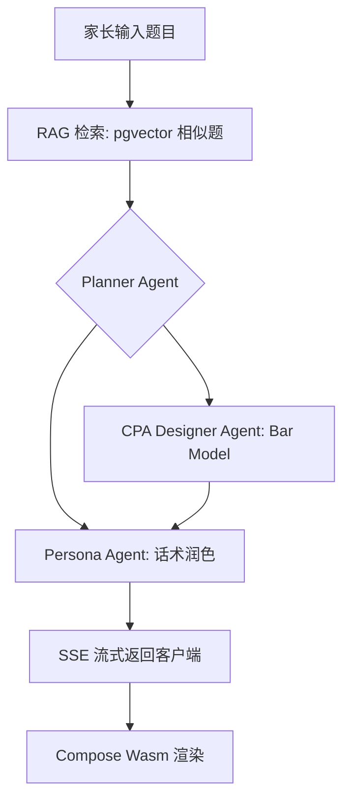

# 新加坡小学数学辅导 App 系统设计文档 (2026 更新版)

## 1. 技术栈选型

| 层次 | 技术 | 版本 | 理由 |
|:---|:---|:---|:---|
| 前端 | Kotlin Multiplatform (Compose Wasm) | 2.1+ | 一套代码覆盖 Web/Android/iOS，MVP 首发 Web 版。 |
| 构建工具 | Gradle | 9.2 | 支持 Java 25，原生 `platform()` BOM（不使用 dependency-management 插件）。 |
| 后端语言 | Java | 25 (LTS) | Structured Concurrency + Scoped Values 实现高可靠 Agent 链。 |
| 后端框架 | Spring Boot | 4.0.3 (Spring Framework 7) | 原生 Virtual Threads，与 Spring AI 2.x 深度集成。 |
| AI 集成 | Spring AI | 2.0.0-M2 | Agentic Workflow 抽象，统一多模型 Agent 协作。 |
| 推理模型 | DeepSeek-R1 / Gemini 2.0 Pro | - | 数学逻辑推理顶尖模型。 |
| 本地开发模型 | Ollama + qwen3.5  | - | 零 API 费用，离线开发，Spring AI 原生支持。 |
| 数据库 | PostgreSQL + pgvector | 17+ | 关系数据与向量检索同库，简化运维。 |
| 缓存 | Redis | 7.x | 缓存 AI 响应、JWT Session。 |

---

## 2. 系统架构

### 2.1 Agentic Workflow (代理工作流)

系统采用 Spring AI 2.x 的多 Agent 协同模式：

| Agent | 职责 | 输入 | 输出 |
|:---|:---|:---|:---|
| **Planner Agent** | 解析题目意图，拆解知识点与计算步骤 | 原始题目 + RAG 上下文 | 结构化解题计划 (JSON) |
| **CPA Designer Agent** | 将解题步骤映射为 Bar Model 可视化描述 | 解题计划 | Bar Model JSON (坐标/颜色/标注) |
| **Persona Agent** | 根据目标角色（家长/孩子）调整输出语气 | 解题计划 + Bar Model | 家长导引 + 儿童趣味脚本 |

> 注：数值计算由 LLM 推理完成（DeepSeek-R1 数学准确率已达 95%+），无需额外引入计算引擎。如未来需要 100% 精确度，可通过 Spring AI Tool Calling 调用 Java 数学库。

### 2.2 数据流转图



### 2.3 整体部署架构

```
┌──────────────────────────────────────────────┐
│           Compose Wasm (Web 前端)             │
│     Vercel / Cloudflare Pages 静态托管        │
└──────────────────┬───────────────────────────┘
                   │ HTTPS
┌──────────────────▼───────────────────────────┐
│       Spring Boot 4.0.3 + Spring AI 2.0.0-M2   │
│              (Fly.io / AWS ECS)               │
│  ┌────────────┐  ┌────────────┐              │
│  │ Solve API  │  │  Auth API  │              │
│  └─────┬──────┘  └─────┬──────┘              │
│        │                │                     │
│  ┌─────▼──────┐  ┌──────▼─────┐              │
│  │ Spring AI  │  │ PostgreSQL │              │
│  │ Agent Chain│  │ + pgvector │              │
│  └─────┬──────┘  └────────────┘              │
│        │                                      │
│  ┌─────▼──────┐  ┌────────────┐              │
│  │ LLM API   │  │   Redis    │              │
│  │ (云端/本地)│  │  (缓存)    │              │
│  └────────────┘  └────────────┘              │
└──────────────────────────────────────────────┘
```

---

## 3. 数据模型

### 3.1 PostgreSQL Schema

```sql
-- 启用 pgvector 扩展
CREATE EXTENSION IF NOT EXISTS vector;

-- 用户表
CREATE TABLE users (
    id         UUID PRIMARY KEY DEFAULT gen_random_uuid(),
    email      VARCHAR(255) UNIQUE NOT NULL,
    password   VARCHAR(255) NOT NULL,
    created_at TIMESTAMPTZ DEFAULT NOW()
);

-- 学生档案
CREATE TABLE student_profiles (
    id        UUID PRIMARY KEY DEFAULT gen_random_uuid(),
    parent_id UUID REFERENCES users(id) ON DELETE CASCADE,
    name      VARCHAR(100) NOT NULL,
    grade     INTEGER NOT NULL CHECK (grade BETWEEN 1 AND 6),
    created_at TIMESTAMPTZ DEFAULT NOW()
);

-- 解题记录
CREATE TABLE solve_records (
    id             UUID PRIMARY KEY DEFAULT gen_random_uuid(),
    student_id     UUID REFERENCES student_profiles(id) ON DELETE CASCADE,
    question_text  TEXT NOT NULL,
    parent_guide   TEXT,
    child_script   TEXT,
    bar_model_json JSONB,
    knowledge_tags TEXT[],
    created_at     TIMESTAMPTZ DEFAULT NOW()
);

-- 知识点进度
CREATE TABLE knowledge_progress (
    id             UUID PRIMARY KEY DEFAULT gen_random_uuid(),
    student_id     UUID REFERENCES student_profiles(id) ON DELETE CASCADE,
    knowledge_code VARCHAR(50) NOT NULL,
    mastery_score  DECIMAL(5,2) DEFAULT 0,
    attempt_count  INTEGER DEFAULT 0,
    correct_count  INTEGER DEFAULT 0,
    updated_at     TIMESTAMPTZ DEFAULT NOW(),
    UNIQUE (student_id, knowledge_code)
);

-- 题库向量表 (RAG)
CREATE TABLE sg_math_questions (
    id        SERIAL PRIMARY KEY,
    content   TEXT NOT NULL,
    embedding vector(768),
    metadata  JSONB
);

CREATE INDEX ON sg_math_questions USING hnsw (embedding vector_cosine_ops);
```

---

## 4. API 接口设计

| 方法 | 路径 | 描述 | 鉴权 |
|:---|:---|:---|:---|
| POST | `/api/v1/auth/register` | 家长注册 | 无 |
| POST | `/api/v1/auth/login` | 登录，返回 JWT | 无 |
| POST | `/api/v1/students` | 创建学生档案 | JWT |
| GET  | `/api/v1/students` | 获取名下所有学生 | JWT |
| POST | `/api/v1/solve/stream` | 流式解题（SSE） | JWT |
| GET  | `/api/v1/records/{studentId}` | 解题历史 | JWT |
| GET  | `/api/v1/knowledge/{studentId}` | 知识点掌握度 | JWT |

### 请求/响应示例

```json
// POST /api/v1/solve/stream
// Request:
{
  "question": "小明有 x 个苹果，妈妈又给了他 3 个。如果 x = 5，他现在有多少个苹果？",
  "grade": 6,
  "studentId": "uuid-xxx"
}

// Response (SSE stream):
data: {"type":"parent_guide","content":"本题考查 P6 代数代换..."}
data: {"type":"child_script","content":"宝贝，x 是一个神奇的魔法盒子..."}
data: {"type":"bar_model","content":{"bars":[...]}}
data: [DONE]
```

---

## 5. Spring AI 多环境配置

```yaml
# application-dev.yml (本地开发 - Ollama)
spring:
  ai:
    ollama:
      base-url: http://localhost:11434
      chat:
        model: qwen3.5 
      embedding:
        model: nomic-embed-text

# application-prod.yml (生产 - DeepSeek / Gemini)
spring:
  ai:
    openai:
      base-url: https://api.deepseek.com
      api-key: ${DEEPSEEK_API_KEY}
      chat:
        options:
          model: deepseek-reasoner
```

---

## 6. 本地开发环境

### Docker Compose 一键启动

```bash
cd infra && docker compose up -d   # 启动 PostgreSQL + pgvector, Ollama, Redis
ollama pull qwen3.5                # 拉取本地模型
cd ../backend && ./gradlew bootRun --args='--spring.profiles.active=dev'
```

---

## 7. 路线图

- **Phase 1 (MVP, 4 周)**: 核心解题 Agent 链 + Web 端原型。
- **Phase 2**: 知识图谱 + 学生档案系统 + 错题本。
- **Phase 3**: OCR 拍照识题 + 交互式 Bar Model 动画。
- **Phase 4**: 移动端 App (Android/iOS) + 前端本地推理（ONNX，可选）。
